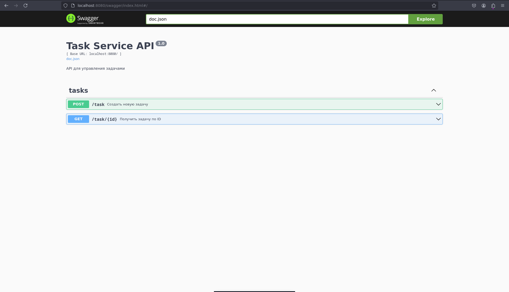

# TestovoeTaskAPI

## Тестовое задание на создание HTTP API для создания  I/O bound задач

### Список реализованных фич
- REST API на Gin
- База дынныз SQLite
- Redis для создания асинхнонной очереди запросов
- Swager документация
- CRUD-операции для задач


## Инструкции по установке и запуску

1. Перейдите в директорию docker
```bash
cd docker
```

2. Запуск Docker контейнера с Redis
```bash
sudo docker-compose up -d
```

3. Перейдите в корень проекта
```bash
cd ../
```

3. Установите зависимости
```bash
go mod tidy
```

4. Запуст HTTP API
```bash
go run main.go
```

### Документация: http://localhost:8080/swagger/index.html


## Превью

